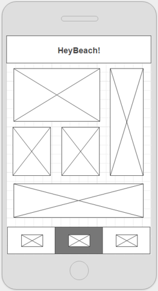

# Solution summary

## 1. General:

For the underlying architectue I structured the code after the Clean Architecture patter. By doing so I divided the code into the top level packages "ui", "domain" and "model".

The "model" package holds all classes that are relevant to data access, which includes API client classes, JSON model classes, converters and exceptions.

The "domain" holds the implementation of the domain logic. As of the "Clean Architecture" patten, I implemented each use case in a Use Case (a.k.a. Interactor) class. These use case classes also handly the asynchronous execution of long running operations.

The "ui" package holds the view-related classes. For the implementation of the UI layer I implemented the Model View Presenter pattern. So besides Activity and Fragment classes, the "ui" package also holds the presenters. Activities and fragments implement a presenter interface. This way, the presenter does not know about the Android framework and is so easier to unit test. To support the lose coupling I used the dependency injection pattern in all the classes that should potentially be unit-testable. This way all dependency of a class can be given in via the constrctor and are so exchangable by mock instances.
Furthermore, to decouple the presenter from the Android framework, I also extracted the screen navigation into a separate class, the ScreenNavigator.

Providing the dependencies is satisfied by the DependencyProvider class. This class does what basically a dependency injection framework like Dagger would do.

For async operations I initially used Android's combination of Handler, HandlerThread and Looper. This way I could do the async handling 
inside the presenter, instead of the Activity/Fragment itself. Later on I switched to the ExecutorService which made it possible to 
remove the Android Handler classes even from the presenter.
 AsyncTask, Loaders or Services would generally be options as well. For me they are not real options as they make it difficult to 
 impossible to combine those in a Clean Architecture as it couples the code tighter to the Android framework. 

## 2. The priority list

1. Done
2. Done
   <br>
   The authentication state (logged in / out) and the user details are held in memory. In a real app the auth token possibly even the 
   user details should be stored in a secure persistent way.
3. Currently the Account related functionality is responsive. When tapping the Account icon on phones, the Account/Login/Registration 
screens open full screen. On tablets the account screens open as a floating dialog, realized by a an Activity with swapping Fragments and a 
dialog activity theme. For the image list, on tablets I could have used the GridLayoutManager, for example.
4. I initially thought I should draw the image title onto the bitmap itself. This is what I did first. As the title is very long this 
looked ugly and so I asled Mathias if this is really what should be done. It turned out that the title should simply be shown besides the
 image. This is what I did then. So now the list items are CardViews containing the image and the title beside of it.
5. Done. As an improvement a footer could be added that shows the loading progress.
6. Done. Using a 50MB in-memory LruCache. As an improvement this could be extended to a disk cache.
7. Not done. I thought about using the StaggeredGridView, but not sure if that would be exactly the desired result. Also not enough time 
left.

Additional notes:
<br/>
A lot could be improved with the right time. For example:

- the password could be encrypted before sending it over the network
- adding input validation
- handling error responses from the API
- improving design and making layouts event more responsive.
- adding progress indicators where ever long running tasks are executed

(screenshot-phone.png)

(screenshot-tablet.png)

<br/>

<hr/>

<br>

# Welcome
This is the time to show us your coding abilities. We have gathered a series of pictures of beautiful beaches and your
task will be to present them in a sleek and functional way.
The time limit for this challenge, starting now, is _seven days_ **We know this is a demanding task,
so please complete as much as you can**. When you are done just share your git link.

<br>

# Your challenge
The coding challenge will consist on implementing a series of incremental tasks, that will test your skills on
networking, caching, UI, design skills and API implementation. We don't expect you to finish the whole tasks,
but we would love to see how far you can go. So please take the following features listed from highest priority to lowest priority

<br>

# Rules
- Please **do not use any 3rd party libraries** other than the iOS/Android SDK.
- You have complete freedom regarding the flow, transitions and interactions of the app.
- We expect you to follow technical best practices and design a clean, user-friendly app.
<br>

# Priority List
1. The user should see a list of images fetched from the HeyBeach API. (Initially just display the first page from the api)
2. A user should be able to register/login/logout inside the app.
3. Ensure the design interface is responsive and functional on mobile, desktop and/or tablets.
4. Include the image title with each image.
5. Implement some sort of infinite scrolling (Get all the images using the paginated api).
6. Implement some sort of image caching.
7. The image grid can be flexible, respecting the images aspect ratio (non-fixed size grid, check the wireframe, eg. Pinterest style)

<br>



<br>

Thank you for your time and good luck!

<br>


# Api Explanation

### Hello

Test the connection with the server. Just to welcome you!!

```
curl -X GET -H "Content-Type: application/x-www-form-urlencoded" -H "Cache-Control: no-cache" "http://139.59.158.8:3000/hello"
```

### Register

Registers an user in Hey beach platform. Pay attention to the headers where you receive your x-auth token.

```
curl -X POST -H "Content-Type: application/json" -H "Cache-Control: no-cache" -d '{
  "email":"user@xxxx.com",
  "password":"pass"
}
' "http://139.59.158.8:3000/user/register"
```


### Login

Logs in an user in the Hey beach platform. Pay attention to the headers where you receive your x-auth token.

```
curl -X POST -H "Content-Type: application/json" -H "Cache-Control: no-cache"  -d '{
  "email":"user@xxxx.com",
  "password":"pass"
}
' "http://139.59.158.8:3000/user/login"
```

### User/me

Returns a users basic profile. Bear in mind that this requires a valid x-auth token.  

```
curl -X GET -H "x-auth: JWToken" -H "Cache-Control: no-cache" "http://139.59.158.8:3000/user/me"
```

### User/logout

Logs out a user from the Hey beach platform.

```
curl -X DELETE -H "x-auth: JWToken" -H "Cache-Control: no-cache" "http://139.59.158.8:3000/user/logout"
```

### Beaches

Gives you a list of the beaches. The end point is paginated. The size of the page is 5 elements.

```
curl -X GET -H "Cache-Control: no-cache" "http://139.59.158.8:3000/beaches?page=3"
```

### Get an Image

To access an image.

```
http://139.59.158.8:3000/images/ee98bcce-b321-4324-9527-373b8e9c2e55.png
```
